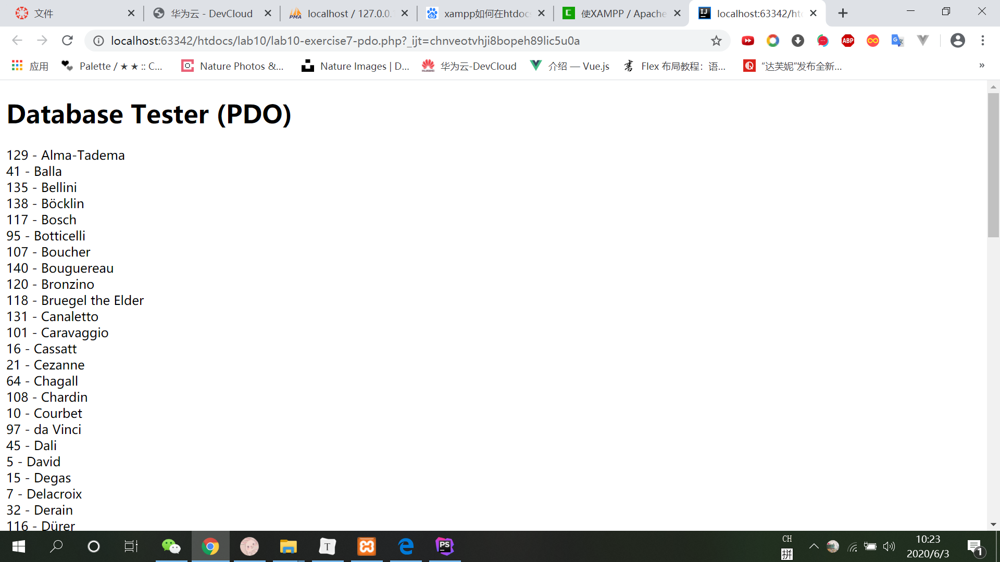
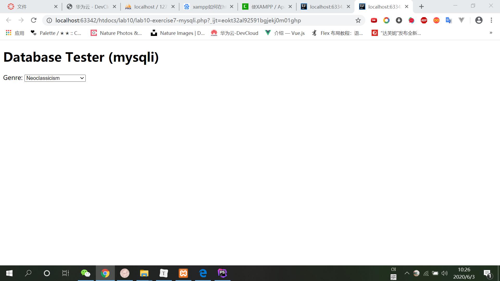
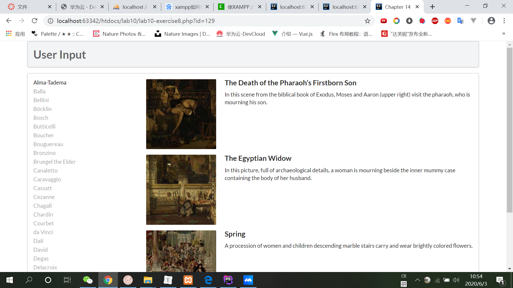
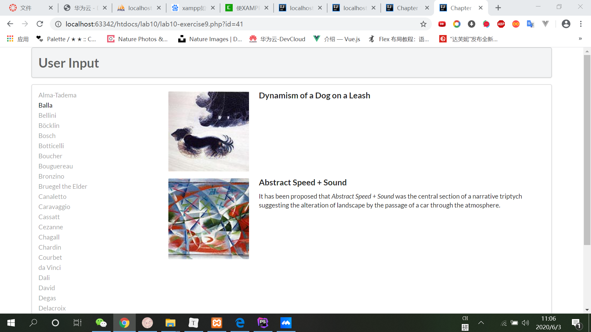

# 设计文档

### exercise7



```php+HTML
 $pdo = new PDO(DBCONNSTRING,DBUSER,DBPASS);  
```

利用PDO链接数据库

```php+HTML
$pdo->setAttribute(PDO::ATTR_ERRMODE, PDO::ERRMODE_EXCEPTION); 
```

处理可能出现的错误

```
$sql = "select * from Artists order by LastName";
  $result = $pdo->query($sql);
```

输入数据库命令并进行查询

```
 while ($row = $result->fetch()) {
      echo $row['ArtistID'] . " - " . $row['LastName'] . "<br/>"; 
  }
```

一行一行输出结果

```
 $pdo = null; 
```

释放资源



```
$connection = mysqli_connect(DBHOST, DBUSER, DBPASS, DBNAME); 
```

先连接数据库

```
if ( mysqli_connect_errno() ) {
   die( mysqli_connect_error() ); 
}
```

处理数据库连接错误

```
$sql = "select * from Genres order by GenreName"; 
if ($result = mysqli_query($connection, $sql)) {
  // loop through the data
  while($row = mysqli_fetch_assoc($result)) {
     echo '<option value="' . $row['GenreID'] . '">'; 
     echo $row['GenreName'];
     echo "</option>";
  }
  // release the memory used by the result set
  mysqli_free_result($result); 
}
```

输入命令并查询，形成html语句，释放资源

```
// close the database connection
mysqli_close($connection);
```

关闭连接

### exercise8



```
function outputPaintings() {
   try {
     if (isset($_GET['id']) && $_GET['id'] > 0) {
       $pdo = new PDO(DBCONNSTRING,DBUSER,DBPASS); 
       $pdo->setAttribute(PDO::ATTR_ERRMODE, PDO::ERRMODE_EXCEPTION);
       $sql = 'select * from Paintings where ArtistId=' . $_GET['id']; 
       $result = $pdo->query($sql);
       while ($row = $result->fetch()) {
          outputSinglePainting($row); 
       }
       $pdo = null; 
     }
   }catch (PDOException $e) {
      die( $e->getMessage() ); 
   }
}

```

数据库操作，主要输出写在outputSinglePainting($row)函数中

```php+HTML
function outputSinglePainting($row) {
   echo '<div class="item">';
   echo '<div class="image">';
   echo ''; 
   //利用数据库中返回的ImageFileName字段构造src
   echo '</div>';
   echo '<div class="content">';
   echo '<h4 class="header">'; 
   echo $row['Title'];//将Title字段放在h4标签中
   echo '</h4>';
   echo '<p class="description">';
   echo $row['Excerpt'];//将Excerpt字段放在p标签中
   echo '</p>';
   echo '</div>'; // end class=content 
   echo '</div>'; // end class=item
}
```

### exercise9



PDO访问数据库，在连接上执行SQL：

##### 使用连接对象的query()方法，返回查询结果集（result set）或FALSE，多用于查询语句

#### 使用连接对象的exec()方法，返回受影响的行数

#### 使用语句对象的execute()方法

用于支持预处理语句（prepared statement）

安全性更好，需要多次提交情况下性能更好

需要分阶段或多步调用实现

通过位置占位符？标志（或命名占位符）和bindValue()实现