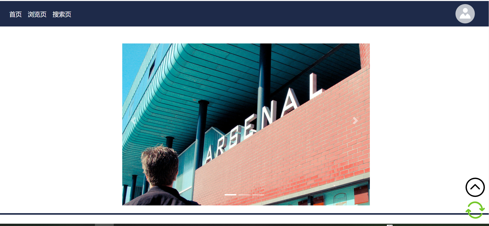
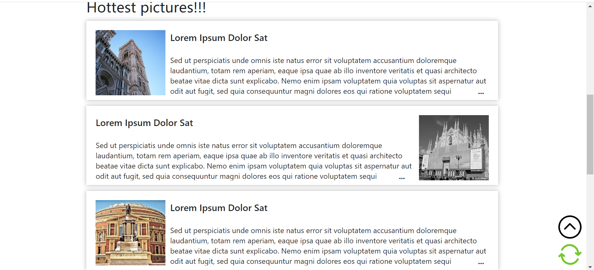
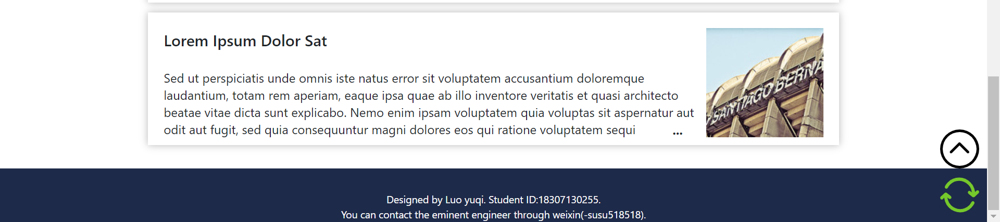

##Lab4设计文档
本次lab我将已经完成的pj主页使用了Bootstrap进行css的简化，深刻体验到了使用bootstrap框架的简洁方便。
###页面展示 

这是主要运用的bootstrap框架的地方，我使用bootstrap导航栏先将导航栏基本外形成型，对背景色和文字颜色进行了调整，使之符合我原本网页的配色。个人主页那个图标点击后会出现下拉菜单的所有css也全部由bootstrap下拉菜单取代，仅仅将原本的按钮换成了图标、调整了组件在页面中的位置。而下面的轮播图则使用了bootstrap轮播图，将原本的左右调节按钮的位置进行了调节。

这是pj主页原本的设计，利用阴影凸显出承载图片、标题和文字的div。

这是主页的脚部，与导航栏风格保持一致。
