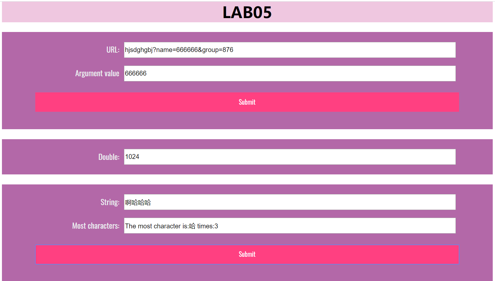

# lab5设计文档

## 设计说明

### 第一题：

```javascript
let url = document.getElementById("url");
let url_submit = document.getElementById("url_submit");
let url_result = document.getElementById("url-result");
url_submit.addEventListener('click',showWindowHref);
function showWindowHref(){
    let currUrlValue = url.value;
    //先处理未经输入的情况
    if(currUrlValue === null || currUrlValue.trim() === ''){
        url_result.value = '嘿！为什么不输入？';
        return;
    }
    //如果不存在'？'
    let startIndex = currUrlValue.indexOf('?');
    if(startIndex === -1){
        url_result.value = '嘿！为什么不输入url？';
        return;
    }
    let subString = currUrlValue.substring(startIndex + 1);
    let arr = subString.split('&');
    //'？'后什么都没有
    if(arr.length === 0){
        url_result.value = '嘿！找不到name';
        return;
    } else {
        for(let i = 0; i < arr.length; i++){
            if(arr[i].substring(0,arr[i].indexOf('=')) === 'name'){
                url_result.value = arr[i].substring(arr[i].indexOf('=') + 1);
                return;
            }
        }
    }


}
```

主要思路是按照url格式的要求，先取出‘？’后面的字符串，用split函数以&为界分割字符串，再在产生的数组中判断字符串中‘=’的前面是否是name，如果是，取出‘=’后面的内容

### 第二题：

```javascript
let mul = document.getElementById("mul");
window.onload = function () {
    timeTest();
}
function timeTest(){
    mul.value = 1;
    let count = 0;
    const interval = window.setInterval(function () {
        mul.value *= 2;
        count++;
        if(new Date().getSeconds() === 0 || count === 10){
            window.clearInterval(interval);
        }
    }, 5000);


}
```

函数非常简单，但是在运用setInterval函数的过程中了解到该函数并不能准确计时，有可能计时器在插入代码的时候忽略正在插入的代码。以及一开始使用了‘mouseover’触发函数，但是这样有可能导致误触，即前一个计时器还没有删除就创造了一个新的计时器，导致mul.value的值比count增加速度快一倍。最后改成了onload事件触发。

### 第三题：

```javascript
let most = document.getElementById("most");
let result = document.getElementById("most-result");
let most_submit = document.getElementById("most_submit");
most_submit.addEventListener('click',arrSameStr);
function arrSameStr(){
    let str = most.value;
    let count = {};//注意一定要这种形式先定义一下对象
    for(let i = 0; i < str.length; i++){
        if(count[str.charAt(i)] === undefined){
            count[str.charAt(i)] = {
                value:1
            };
        }else {
            count[str.charAt(i)].value++;
        }
    }
    let max = 0;
    let maxChar;
    for(let item in count){
        if(count[item].value > max){
            max = count[item].value;
            maxChar = item;
        }
    }

    result.value = "The most character is:" + maxChar + " times:" + max
}
```

思路就是用一个count对象储存类似键值对的东西，最后找出最大的就行。

## 网页截图



## GitHub截图

