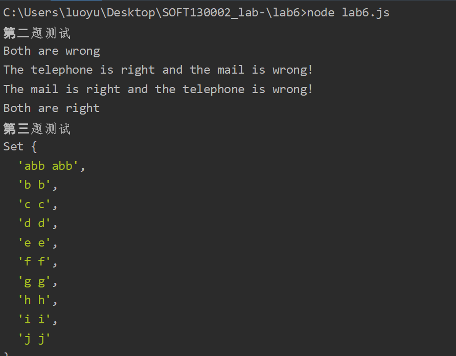
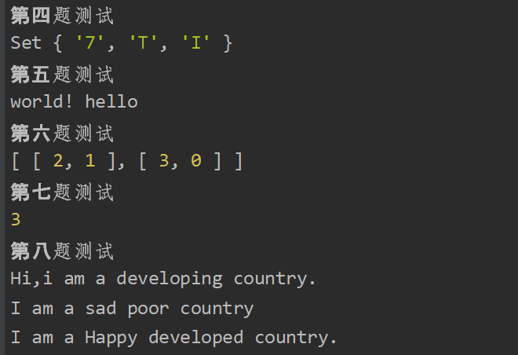
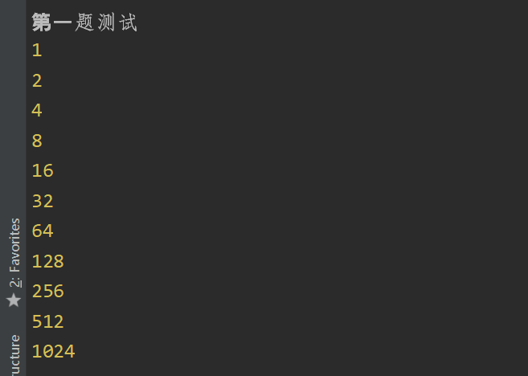
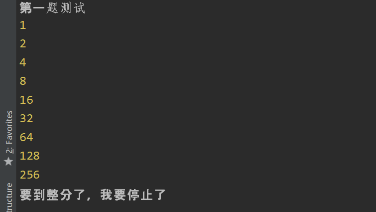
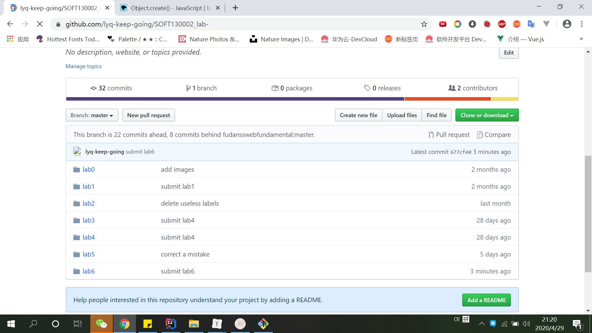

# Lab6设计文档

## 正则表达式解释

```javascript
	let telephoneReg = /^\d{11}$/;
	//表示11位0-9数字
    let mailReg = /^\w[\w_\.-]*@[a-zA-Z\.]+\.[a-zA-Z]{2,4}$/;
	//邮箱的第一位是数字字母，接下来是数字字母下划线小数点横杠，然后是@，接下来就是字母加小数点穿插，最后一个小数点后面的字母是2-4位
```

```javascript
let wordsSet = new Set(str.split(' '));
    let regExpStr = '';
    for(let value of wordsSet){
        let newSubStr = '(' + value + ' ' + value + ')';
        regExpStr += newSubStr + '|';
    }

    regExpStr = regExpStr.substring(0,regExpStr.length - 1);
    let re = new RegExp('^' + regExpStr + '$','ig');
    let result = str.match(re);
```

这个我是先将员字符串中单词放进Set中遍历了Set后动态合成了一个正则表达式，类似^(a a)|(b b)$这样

## 继承不同方式的理解

#### 原型链继承

```javascript
//PoorCountry利用原型链继承
function PoorCountry() {}//构造函数
PoorCountry.prototype = new Country();
PoorCountry.prototype.saySad = function () {
    console.log('I am a sad poor country');
}
```

原型链继承主要特点是利用父类的一个实例作为子类的prototype

#### 借用构造函数继承

```javascript
//DevelopingCountry借用构造函数继承
function DevelopingCountry() {
    Country.call(this);
    this.sayHi = function () {
        console.log('Hi,i am a developing country.');
    }
}
```

关键是Country.call(this)，在子类构造方法中利用call函数将父类构造函数中的this都指向子类了（强行将父类构造函数调用者变为子类构造函数），可以利用父类构造函数中定义的属性

#### 用Object.create()继承

```javascript
//DevelopedCountry用Object.create()原型式继承
function DevelopedCountry(){
    Country.call(this);//这个语句是为了调用父类的构造方法，这样子类才有name这个值
}

DevelopedCountry.prototype = Object.create(Country.prototype);//原型对象的复制
DevelopedCountry.prototype.constructor = DevelopedCountry;
DevelopedCountry.prototype.sayHappy = function () {
    console.log('I am a Happy developed country.');
}
```

主要是Object.create()对原型对象进行了复制，将子类的原型赋值为它

## Map、Set、Array之间的区别和使用

Map是键值对，可以利用键值对之间的映射关系，在value中储存一个对key有用的信息

Set是集合，有去重功能

Array是数组，允许重复，便于排序

## 本地命令行截图









## Github截图

