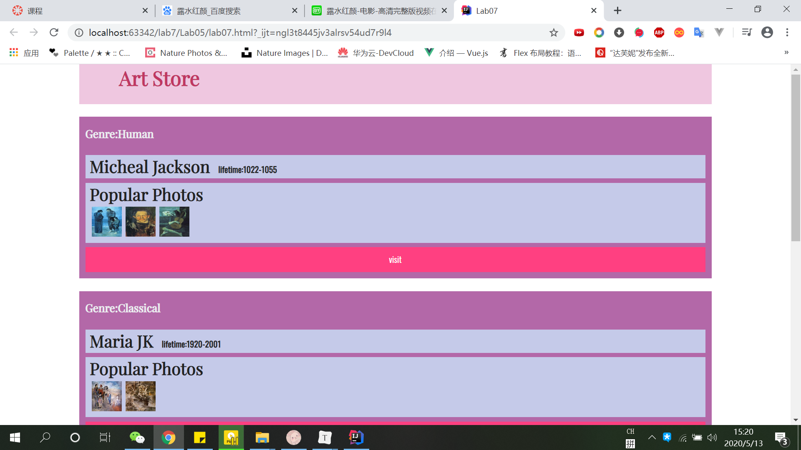
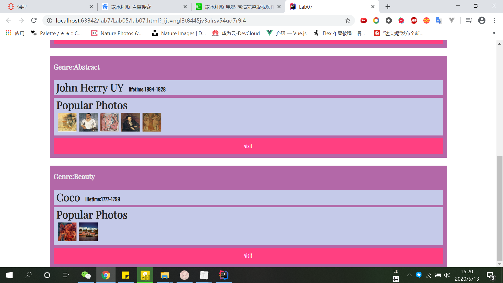

# lab7设计文档

一开始不知道css里给自己写好了这么多样式，全都自己写了吭哧吭哧写了一遍，sad......

主要方法就是根据css给的类名和结构的提示来组织html。助教给了works的数组，所以用for循环生成最外层div，class设为item其他的也是类似的思路。实现代码如下：

```javascript
document.documentElement.ondblclick = function () {
    for(let item of works){
        let outerDiv = document.createElement('div');
        outerDiv.className = 'item';
        let genre = document.createElement('h4');
        genre.innerText = 'Genre:' + item.tips;
        outerDiv.appendChild(genre);
        //------------------------------
        let person = document.createElement('div');
        person.className = 'inner-box';
        let name = document.createElement('h3');
        name.innerHTML = item.author;
        name.style.display = 'inline';
        let lifetime = document.createElement('h5');
        lifetime.innerHTML = 'lifetime:' + item.lifetime;
        lifetime.style.display = 'inline';
        lifetime.style.marginLeft = '1em';
        person.appendChild(name);
        person.appendChild(lifetime);
        outerDiv.appendChild(person);
        //-----------------------------------
        let popularPhotos = document.createElement('div');
        popularPhotos.className = 'inner-box';
        outerDiv.appendChild(popularPhotos);
        let title = document.createElement('h3');
        title.innerText = 'Popular Photos';
        popularPhotos.appendChild(title);
        for(let photo of item.photos){
            let img = document.createElement('img');
            img.src = photo;
            img.className = 'photo';
            popularPhotos.appendChild(img);
        }
        //------------------------------------------------
        let button = document.createElement('button');
        outerDiv.appendChild(button);
        button.innerText = 'visit';
        document.getElementsByClassName('justify')[0].appendChild(outerDiv);

    }
}
```

以下是我页面截图：





